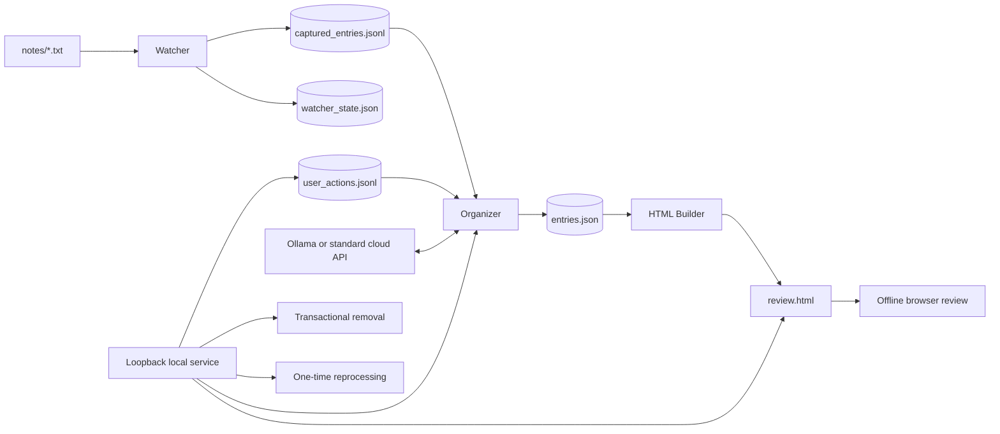
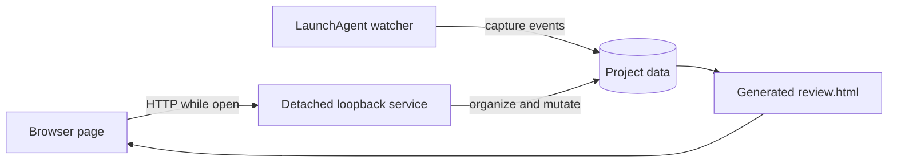

# System Design

> **中文摘要见本文末尾。** A Chinese summary is available at the end of this document.

## 1. Purpose

My Notes Tool turns plain-text project notes into a structured, searchable, offline review experience while preserving three properties:

1. The original TXT files remain human-owned and are never rewritten by the application.
2. Local processing is the default; cloud processing is explicit and scoped.
3. Every destructive or expensive workflow has a narrow, reviewable boundary.

The project intentionally uses the Python standard library for the runtime. The generated review page is a single self-contained HTML file with embedded data, styles, JavaScript, and a vendored Markdown renderer.

## 2. Design Principles

### Local-first, not local-only

The default model backend is Ollama. Users may opt into a standard OpenAI-compatible Chat Completions API, but cloud use requires an explicit privacy and cost acknowledgement. Model settings and secrets live outside the repository.

### Source files stay authoritative

TXT files are the user's writing surface. The application captures and derives information from them, but does not edit them. This avoids surprising source mutations and keeps the notes portable.

### Append facts, derive views

Capture history and user visibility actions are append-only event streams. `entries.json` and `review.html` are derived projections. This separates factual history from current presentation.

### Conservative automation

The watcher recognizes likely edits only when similarity is strong and unambiguous. When evidence is weak, it records a new entry rather than silently merging unrelated notes.

### Validate model output locally

The model is treated as an untrusted component. Classification values, timestamps, Markdown formatting, and table coordinates are validated before being stored or displayed.

### Explicit exceptional operations

Daily organization is incremental. Historical reprocessing and permanent generated-data removal are separate workflows with preview, confirmation, locking, and recovery boundaries.

## 3. High-Level Architecture



The runtime is divided into five ownership areas:

| Area | Main modules | Responsibility |
| --- | --- | --- |
| Capture | `watcher.py` | Split complete records, detect inserts or likely edits, append events, maintain snapshots |
| Organization | `organize.py`, `llm_adapter.py`, `table_layout.py` | Fold events, call the model, validate results, update derived caches |
| Presentation | `build_html.py`, `output/review-mock.html` | Validate structured records and generate the self-contained review page |
| Local operations | `local_server.py`, `launch_tool.py` | Serve the fixed page, authenticate writes, run jobs, report progress |
| Data removal | `purge.py` | Plan and execute exact, recoverable multi-file removal transactions |

## 4. Record Capture

### Record boundary

A record ends when the watcher sees three consecutive blank lines. One or two blank lines can remain inside a record for readable formatting. The separator is configurable.

The splitter returns two values:

- Complete records that may be captured
- An unfinished tail that remains in watcher state until the separator is completed

This prevents half-written text from being sent to a model.

### Stable snapshots and append-only events

The watcher stores per-file snapshots in `watcher_state.json`. Changes are appended to `captured_entries.jsonl` as `insert` or `update` events.

An update is emitted only when:

- The old and new records are sufficiently similar
- Short records pass a stricter threshold
- The best candidate is separated from alternatives by a minimum margin

This conservative matcher supports edits at arbitrary positions while reducing accidental identity migration.

### Concurrency

Manual scans and the background watcher share `watcher-scan.lock`. Organization and reprocessing use `organize.lock`. Permanent removal acquires both locks in a fixed order to avoid races and deadlocks.

## 5. Event Folding and Derived State

The organizer folds capture events into the latest logical snapshot for each stable record ID. It also folds `hide` and `restore` events from `user_actions.jsonl` into a visibility projection.

`entries.json` contains the latest structured records and model-generated caches. It is replaceable: the event streams and source TXT files remain the factual inputs.

Important derived fields include:

- `category`, `status`, and `event_time`
- `display_markdown` plus a source-text hash
- Coordinate-only table structures plus a source-text hash and schema version
- Opaque backend fingerprints
- `hidden`, `hidden_at`, and `user_edited`

## 6. Model Boundary

### Shared business adapter

Ollama and the standard OpenAI-compatible transport feed the same business adapter. Prompts, validation, source-text protection, and cache semantics are backend-independent.

### Classification validation

The adapter accepts only configured category codes and the stable status values:

- `todo`
- `done`
- `none`

Event times must be valid timezone-aware ISO 8601 values or `null`.

When the first non-empty line is exactly a valid `MMDD` marker, the adapter deterministically resolves it with the capture year and timezone and gives it precedence over a model-selected future date. The prompt also directs meeting minutes to use the recorded meeting date rather than future meetings, deadlines, or plans mentioned in the body.

### Formatting without rewriting

The formatting model never returns rewritten text. It returns sparse one-based line assignments such as `{"line": 8, "style": "h2"}` only for non-plain lines. Omitted lines remain plain; duplicate or out-of-range line numbers and invalid styles are rejected. The application applies permitted Markdown markers locally and verifies that the original characters and line order remain unchanged.

This is a distinctive safety property: visual structure may change, but note content cannot be silently paraphrased by the formatter.

### Table recognition without generated cell text

The application detects candidate table blocks deterministically. The model returns coordinates and structural metadata only. Cell text is always read from the original note.

If a candidate cannot be validated, the page displays a safe raw-text fallback instead of inventing a table.

### Cache identity

Generated fields store an opaque SHA-256 backend fingerprint. The fingerprint identifies the non-secret backend configuration without exposing the API key, endpoint, or model name.

Changing a backend does not automatically invalidate historical results. Existing notes are reprocessed only through the explicit one-time workflow.

## 7. Offline Review Page

`build_html.py` validates every record before embedding it into `review.html`. Script terminators and HTML-sensitive characters are escaped during JavaScript serialization.

The final page contains:

- Embedded structured data
- Embedded CSS and JavaScript
- A vendored Markdown renderer
- Project tabs, filters, sorting, hidden-record review, and responsive layouts

When opened directly from disk, the page is read-only. When served by the local service, authenticated mutation controls become available.

This split keeps the artifact portable while preserving richer local workflows.

The three HTML artifacts have separate responsibilities:

- `output/review-mock.html` is the build template and intentionally contains six fictional mock records for interface previews. The builder replaces its `BUILD:ENTRIES` block with the target data in each generated page; it does not import the mock records into user data. The template must never contain real personal or company information.
- `output/demo-review.html` is a deterministic, pre-generated page built from the bundled fictional TXT notes by `build_demo.py`.
- `output/review.html` is the user's generated review page and starts with an empty data set in the repository.

## 8. Loopback Service Security

The local service binds to `127.0.0.1` only. It serves fixed resources and exposes a small set of fixed APIs; it does not accept arbitrary commands or paths.

Write requests require:

- An exact allowed Host
- A same-origin Origin
- A random startup token
- JSON content type
- Endpoint-specific bounded request sizes and allowlisted fields

CORS is not enabled. Cloud error bodies are consumed but never echoed to the browser. API keys are redacted again at the service boundary as defense in depth.

The click launcher reuses a healthy service or starts a detached one, then opens `http://localhost:8765/`.

### Project-instance identity

A generic `{"status":"ok"}` health response is not enough when multiple copies of the application exist. A service started from an old or moved directory may continue listening on port `8765` even after its files are no longer available. Reusing that process can open the wrong data set or return `review_not_found`.

At startup, both the service and launcher derive an instance ID by hashing the resolved project directory with SHA-256. The health endpoint returns only this digest, never the local path. The launcher reuses a service only when the returned digest matches its own instance ID.

If another note-tool instance owns the port, the launcher reports the conflict and asks the user to close it. It does not automatically terminate an unknown process. This makes project moves explicit and avoids one copy silently controlling another copy's data.

### Process lifecycle

The visible page, local HTTP service, and watcher are separate lifecycle units:



- Closing the browser stops only the UI session; the detached HTTP service may continue listening.
- Stopping the HTTP service does not stop a watcher installed as a LaunchAgent.
- Uninstalling the watcher does not delete notes or generated data.
- Moving the project requires restarting the HTTP service and reinstalling the watcher so both resolve the new directory.
- One default service instance can own port `8765` at a time. Other copies remain available in offline read-only mode or may be started with a different port.

## 9. External Model Configuration

Model configuration is stored under:

```text
~/Library/Application Support/My Notes Tool Public/
```

The directory uses mode `0700`; files use mode `0600`. Symlinked or overly permissive secret files are rejected.

Settings and secrets are separate:

- `deployment.json`: fixed public release capabilities
- `model-settings.json`: non-secret provider settings
- `secrets.json`: API key only, created on demand

Writes use temporary files, `fsync`, and atomic replacement. Saving settings and a key is treated as a two-file bundle with rollback on failure.

The API key is never returned by the settings API, embedded in HTML, logged, or included in a backend fingerprint.

### Configuration namespace isolation

The public application uses its own `My Notes Tool Public` directory name instead of a generic shared configuration directory. This prevents another installed variant from contributing unsupported schema fields or making its API key appear configured in the public application.

The public configuration schema accepts only its allowlisted provider fields. Unknown top-level protocol objects are rejected rather than silently preserved. When the public configuration directory does not exist, reads return an in-memory default of local Ollama without creating files. The directory is created only when the user explicitly saves settings.

## 10. One-Time Historical Reprocessing

Switching models affects new or changed notes only. The UI exposes two bundled operations while the backend retains separate analysis, formatting, and table stages:

- **Full reorganization** groups records by their analysis backend and reruns analysis, formatting, and table recognition with the current model. Table recognition is called only when deterministic local detection finds a candidate.
- **Repair degraded results** targets only formatting without a valid backend and table candidates without a valid table backend. Analysis is not rerun, so this mode may intentionally produce mixed stage origins to save tokens.

Both modes use a composite scope: multiple projects, an optional inclusive `record_time` date range, and visible/all/hidden visibility. Project search appears at six or more projects; bulk actions support select all, clear, and invert the current search result.

Full mode filters by original analysis-model source. The current model is visible but disabled by default and requires an explicit override. Sources are grouped by stable result identity: provider, cloud variant, and model/deployment. Credentials, endpoints, timeouts, CA paths, headers, and prompt or formatting protocol revisions do not split a source. A private `model-history.json` stores only fingerprint, label, provider, and model outside the repository.

The read-only plan reports selected records, work by stage, actual table-candidate model calls, input characters, and a broad mixed Chinese/Latin token range. The estimate covers note content and table-candidate data only; fixed prompts, schemas, and output tokens are excluded. It is local decision support, not a billing prediction.

The workflow is:

1. Select mode, projects, record dates, and visibility.
2. In full mode, select one or more original model sources.
3. Request a read-only plan without calling a model.
4. Review work and estimated cost.
5. Confirm the exact plan; cloud jobs require an additional privacy and cost acknowledgement.
6. Recompute under the organization lock and execute only if the plan ID still matches.

The plan ID hashes:

- Mode, composite scope, and selected source models
- Selected record identity and relevant state
- Current non-secret model settings

Execution acquires the organization lock and recomputes the plan. If the plan ID changed, execution is rejected. A plan can be consumed only once.

Records with `user_edited: true` keep their classification, status, and event time. Full mode may still refresh their formatting and necessary table recognition.

## 11. Hide, Restore, and Permanent Removal

Hide and restore actions append events; they do not erase history.

Permanent removal is intentionally different. It is available only for hidden records and targets exact IDs and event chains. The operation prepares new versions of:

- Capture history
- Structured entries
- User actions
- Watcher snapshots
- Generated HTML
- Accessible current and rotated logs

The operation uses a short-lived transaction directory containing a manifest, prepared files, and a backup. Prepared data is validated before replacement; live data is validated afterward. Failures restore the backup. Successful completion removes the transaction directory.

The source TXT remains untouched. If the text remains there, it may be captured again. The operation also cannot erase cloud sync history, backups, filesystem snapshots, browser caches, or old storage blocks.

## 12. Failure and Recovery Model

- Event and action files are append-only.
- Structured JSON writes use temporary files and atomic replacement.
- Model results are saved record by record after validation.
- Classification failure prevents publication of an incomplete review page.
- Formatting and table-enhancement failures use safe raw-text fallbacks and allow daily page publication.
- Existing valid caches remain available when a later model call fails.
- Incomplete removal transactions are recovered at service startup.
- Lock acquisition is non-blocking for user operations, producing clear conflict responses instead of overlapping writes.

### Cooperative cancellation

Daily organization uses a per-job cancellation marker passed to the `review.py` subprocess. Historical reprocessing uses a thread-safe event. A cancel request does not terminate an active model or HTTP call. The signal is checked after that call returns but before its result is stored, between records and components, and before HTML generation.

- Fully saved earlier records remain available.
- The in-flight result is discarded when cancellation was requested during the call.
- Later records and stages are not started.
- The review page is not rebuilt.
- The job reaches `cancelled`, releases its lock, and removes its marker.
- Cancellation is rejected after the rebuilding stage starts because replacement may already be in progress.

The job exposes a non-secret wait limit derived from the active model timeout. The UI shows elapsed cancellation time and an approximate maximum remaining wait; most requests return sooner.

### Local diagnostics

`OrganizeJobManager` and `ReprocessJobManager` share one `DiagnosticStore` for the five most recent terminal organization or historical-reprocessing reports in `data/diagnostics.json`. A task that completes through a safe formatting or table fallback is recorded as `succeeded_with_fallback`, not plain `OK`. The loopback-only UI reads reports through `/api/diagnostics` and can copy the latest sanitized summary. Reports contain task identifiers, timestamps, status, stage, stable error code, controlled guidance, duration, platform, and Python major/minor version. They never store raw error text, note content, credentials, model responses, URLs, or full paths. The file uses mode `0600` and survives service restarts.

## 13. Privacy and Release Boundaries

The public repository contains fictional TXT files, fictional mock records in the build template, and a separately generated fictional demo page. Runtime data files and the initial user review page remain empty. A release must never be built by cleaning a real-data working copy in place.

Release checks include:

- Search for credentials, certificates, email addresses, organization-specific names, private URLs, and machine paths
- Inspect generated HTML because it embeds data
- Remove logs, locks, caches, and local model settings
- Build an archive from the clean directory
- Extract the archive and rerun the test suite

The fictional demo page is generated separately from the bundled TXT notes so documentation and screenshots can show realistic output. The template's mock records serve only as interface-preview content; neither they nor the demo page populate the initial user data.

See `RELEASE_CHECKLIST.md` for the operational checklist.

## 14. Trade-offs

### Polling instead of filesystem events

Polling is less immediate than platform-specific event APIs, but it is simple, dependency-free, predictable across common editors, and easy to test.

### JSON files instead of a database

The data volume is small and personal. JSON keeps the system inspectable and portable. Atomic replacement and process locks provide the required consistency without introducing a database dependency.

### A generated single HTML file

Embedding data increases file size, but produces a durable offline artifact that can be opened without a server or build tool.

### Standard-library HTTP instead of an SDK

A narrow transport implementation reduces dependency and packaging complexity. The trade-off is a deliberately small protocol surface and explicit response-shape validation.

### Path-derived instance identity

Hashing the resolved project path avoids exposing that path while reliably distinguishing moved copies. The trade-off is that a move intentionally changes the instance ID: an old service must be stopped before the moved copy starts on the same port.

### Separate configuration namespaces

Separate namespaces prevent settings and secrets from crossing application variants. The trade-off is that users must configure each variant independently; settings are not automatically migrated or shared.

### macOS-first lifecycle integration

The click launcher, `.command` files, Finder guidance, `open`, and LaunchAgent integration are macOS-specific. The core parsing and data logic is portable Python, but Windows and Linux need explicit lifecycle adapters and have not been implemented or validated.

## 15. Future Directions

Potential extensions should preserve the existing boundaries:

- A documented reset command that clears generated data without touching source notes
- Export/import with schema versioning
- More explicit migration tooling for event formats
- Optional encrypted local secret storage
- Additional operating-system support behind platform abstractions
- Accessibility and browser automation coverage

---

## 中文摘要

My Notes Tool 的核心思想是“原始 TXT 由用户掌控，事实用只追加事件记录，页面与结构化 JSON 都是可重建投影”。后台 watcher 只捕获以三个空白行结束的完整记录，并通过保守相似度规则识别修改，避免错误合并。

模型被视为不可信组件：分类值、时间、排版和表格结构都必须在本地校验。排版模型只能返回每行样式，不能改写正文；表格模型只返回坐标，单元格文字始终取自原文。这两点是本工具较有特色的内容保护设计。

静态 `review.html` 可完全离线查看；完整操作通过仅绑定回环地址的本地服务完成，并使用 Host、Origin、随机 token 和固定 API 边界保护写操作。模型默认使用本地 Ollama，标准 OpenAI-compatible API 是显式可选项，Key 存在项目外且不会进入页面、日志或指纹。

浏览器页面、后台 HTTP 服务和 LaunchAgent watcher 是三个独立生命周期：关闭网页不会自动停止服务，停止服务也不会停止 watcher。服务与启动器根据项目绝对路径的 SHA-256 摘要识别实例，只复用同一目录启动的服务；摘要不会暴露原路径。项目搬家后需要停止旧服务，并重新安装 watcher 指向新目录。

公开版使用独立的 `My Notes Tool Public` 配置目录，避免其他安装副本的设置结构或 Key 被误读。配置目录不存在时仅返回内存中的默认 Ollama 设置，用户明确保存后才创建文件。

历史重处理必须先生成只读计划，再确认执行；计划绑定记录状态和模型配置，而且只能使用一次。人工修改过的分类字段会被保护。彻底删除则采用短期事务目录、准备文件、校验、替换和失败恢复，但不会修改原始 TXT，也不能清除外部备份或云同步历史。

当前产品生命周期集成以 macOS 为目标；Windows 和 Linux 尚未实现或验证。默认端口同时只允许一个完整服务实例，但其他副本仍可离线打开生成页面。
